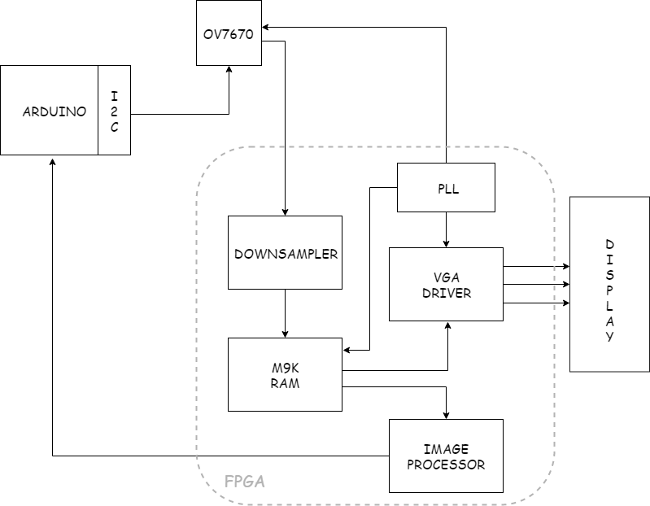

# LAB 3 - FPGA and Shape Detection

In this lab, you will split into two teams to develop an FPGA module capable of detecting basic shapes from a camera input. This device will be mounted on the robot to identify these shapes on the walls of the maze.

Below is a block diagram of the device that will implemented.   

## Prelab

The FPGA being used is the DE0-Nano (Non-SOC). Read some key portions of the DE0-nano's documentation here:

* [DE0-Nano Specifications](http://www.terasic.com.tw/cgi-bin/page/archive.pl?Language=English&CategoryNo=165&No=593&PartNo=2 "Specs")

* [DE0-Nano User Manual](http://www.ti.com/lit/ug/tidu737/tidu737.pdf "The Manual")

The expansion headers on **page 18** of the manual will be particularly useful for planning GPIO from the FPGA to both the Arduino and the camera.

To setup the OV7670 digital camera, you will need to get acquainted with its datasheet here:

* [OV7670 Datasheet](https://www.voti.nl/docs/OV7670.pdf, "Camera stuff")

In order to perform image processing (for our object detection), it is useful to store our image data in a *memory buffer*. Given that the buffer can hold all the pixel data for exactly one image at a time, reading from it is equivalent to scanning through the pixels of the image in one frame of image output from the camera. No buffer exists onboard the OV7670, so one must be created on the DE0-Nano using its onboard **embedded memory**. This embedded memory consists of M9K memory blocks that we may configure to create a RAM. One caveat of this is that each entry in the RAM must have a size of 8 or 9 bits.

We will use a VGA adapter to connect to a display for debugging (to ensure your image comes out properly). The adapter takes pixel data in RGB 332 format (8 bits - 3 red, 3 blue, 2 green). 

*Q1:*
Reviewing the FPGA's specifications, what is the maximum size of buffer that we can create in Kilobits? Given that each entry is , how many entires large can the RAM be?
***Answer***  
*The specification above states that the DE0-Nano has 594 Kbits of embedded memory, allowing for 74,250 8-bit entries*

The OV7670 camera requires being setup every time the camera is powered on. This involves setting registers in the camera, which can be done over the Arduino's I2C interface. The cam also requires the input of some clock. Lastly for inputs, it has an active-low reset pin and a power-down pin. Outputs of the camera include 8 pins for 8b data output and 3 signals for sampling: PCLK(pixel clock), HS(HREF), and VS(VSYNC).
- HREF indicates the start (rising edge) and end (falling edge) of a row of pixels in an image.
- VSYNC indicates the start (falling edge) and end (rising edge) of a frame of an image
- PCLK decides the speed at which the data output is being transmitted. Its rising edge indicates a new byte is ready to be read.

*Q2:*
The OV7670 offers a variety of pixel formats to sample data at (see: Output Formats in "Key Specifications" table). Which of the formats available provides the most info on the base colors making up each pixel?
 ***Answer***  
*RGB 565*

*Q3:*
Given that the input to our VGA adapter is RGB 332. How may we convert (downsize) the pixel format from *Q2* to be accepted by the VGA module.
 ***Answer***  
*Remove the least significant 2b of R, 3b of G, and 2b of B*

*Q4*
Now that we know the downsized space each pixel will take (from Q3), we need to know how many of them we must fit in memory. Which of the predefined resolutions that the OV7670 supports provides the max amount of pixels in an image, given the constrained max size of our buffer(from *Q1*)? What's the size of our buffer?
***Answer***  
*QCIF, 202 Kbits*

*Q5:*
Take a look at the timing diagrams (Fig 5 and 6) on Page 7 (Ignore HSYNC, we don't use it). Use both diagrams to determine when we should sample our data. (Hint: We only want to sample valid bytes, and each one only once)
***Answer***  
*Data is valid only when HREF is LOW and VSYNC is HIGH. To sample each byte only once, sample on the rising edge of PCLK*

*Q4*
Downsizing question

## Lab

PLL

Team Camera

Team Buffer Reader

Combining

Image Processing

