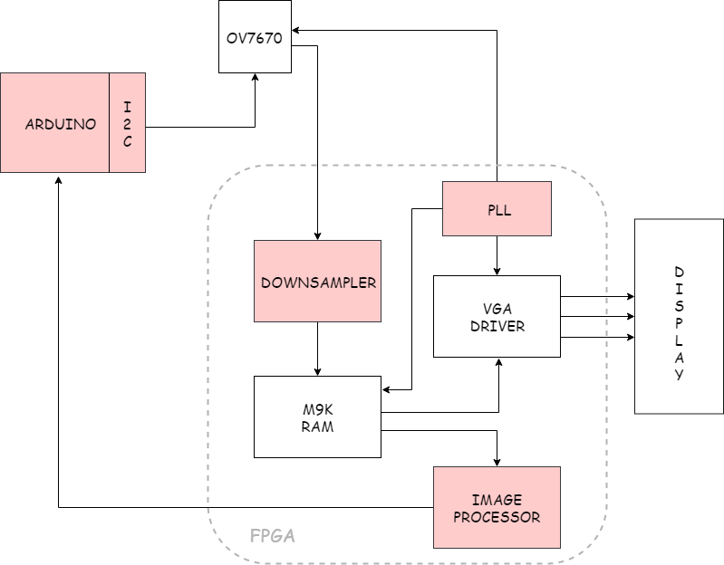

# LAB 3 - FPGA and Shape Detection

In this lab, you will split into two teams to develop an FPGA module capable of detecting basic shapes from a camera input. This device will be mounted on the robot to identify these shapes on the walls of the maze.

Below is a block diagram of the device that will implemented.   

## Prelab

The FPGA being used is the DE0-Nano (Non-SOC). Read some key portions of the DE0-nano's documentation here:

* [DE0-Nano Specifications](http://www.terasic.com.tw/cgi-bin/page/archive.pl?Language=English&CategoryNo=165&No=593&PartNo=2 "Specs")

* [DE0-Nano User Manual](http://www.ti.com/lit/ug/tidu737/tidu737.pdf "The Manual")

The expansion headers on **page 18** of the manual will be particularly useful for planning GPIO from the FPGA to both the Arduino and the camera.

To setup the OV7670 digital camera, you will need to get acquainted with its datasheet here:

* [OV7670 Datasheet](https://www.voti.nl/docs/OV7670.pdf, "Camera stuff")

In order to perform image processing (for our object detection), it is useful to store our image data in a *memory buffer*. Given that the buffer can hold all the pixel data for exactly one image at a time, reading from it is equivalent to scanning through the pixels of the image in one frame of image output from the camera. No buffer exists onboard the OV7670, so one must be created on the DE0-Nano using its onboard **embedded memory**. This embedded memory consists of M9K memory blocks that we may configure to create a RAM. One caveat of this is that each entry in the RAM must have a size of 8 or 9 bits.

We will use a VGA adapter to connect to a display for debugging (to ensure your image comes out properly). The adapter takes pixel data in RGB 332 format (8 bits). 

*Q1:*
Reviewing the FPGA's specifications, what is the maximum size of buffer that we can create in Kilobits? How large in bits?

*Q2:*
RGB question

*Q3*
Resolution and memory question

*Q4*
Downsizing question

## 

